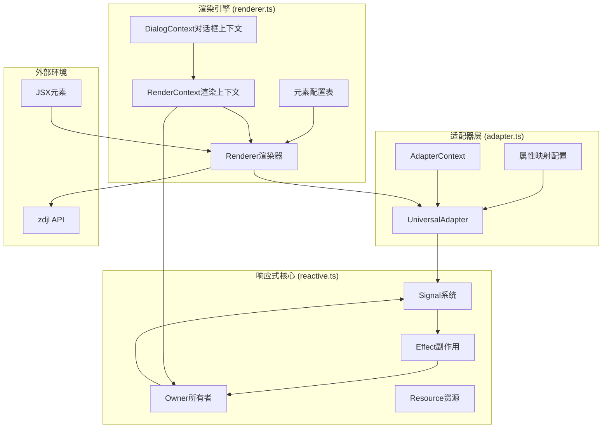

# Kodex
Kodex 是一个为自动精灵平台设计的声明式 UI 工具，其使用 JSX 结构描述自动精灵的 UI(设置变量动作)

# 预览


# TODO
- [x] 值更改事件 : onChange
- [x] 弹窗已创建Hook : dialogCreated
- [ ] select 元素更改默认选中 : 本身不提供,但可以通过更改 options 数组来实现
- [ ] 处理额外文本初次值为空字符串时后续更新无效的问题：即使没有使用Kodex也会这样，可能是自动精灵的机制或bug使然。可以通过显示一个1像素的图片来模拟空字符串

# NOTE
- 当 color 不是全格式时闪退
- 当 backgroundColor 为 null 时闪退
- 当 var name 不合法时闪退  

# 图表

## 核心架构图


## 渲染流程图
```mermaid
flowchart TD
    Start[开始渲染] --> ExtractRoot[提取根元素]
    ExtractRoot --> ProcessHeader[处理Header]
    ExtractRoot --> ProcessMain[处理Main]
    ExtractRoot --> ProcessFooter[处理Footer]
    
    ProcessMain --> CheckType{检查元素类型}
    CheckType -->|Component| HandleComponent[处理组件]
    CheckType -->|Native Element| ConvertElement[转换为变量]
    
    HandleComponent --> ExecuteComponent[执行组件函数]
    ExecuteComponent --> ProcessChildren[处理子元素]
    ProcessChildren --> CheckType
    
    ConvertElement --> GetConfig[获取元素配置]
    GetConfig --> CreateAdapter[创建适配器]
    CreateAdapter --> ApplyMapping[应用属性映射]
    ApplyMapping --> ProcessReactive[处理响应式属性]
    
    ProcessReactive --> GenerateVar[生成变量定义]
    GenerateVar --> RegisterSignal[注册信号]
    
    ProcessHeader --> CreateAction[创建动作]
    ProcessFooter --> CreateAction
    GenerateVar --> CreateAction
    
    CreateAction --> HoistValues[提升值到全局]
    HoistValues --> CreateEventEmitter[创建事件发射器]
    CreateEventEmitter --> ReturnResult[返回渲染结果]
    
    ReturnResult --> End[渲染完成]
  ```

## 关键数据流
```mermaid
sequenceDiagram
    participant JSX as JSX组件
    participant Renderer as 渲染器
    participant Adapter as 适配器
    participant Reactive as 响应式系统
    participant ZDJL as 目标环境
    
    JSX->>Renderer: 传入JSX元素
    Renderer->>Renderer: 提取根元素结构
    
    loop 处理每个元素
        Renderer->>Adapter: 创建适配器并应用映射
        Adapter->>Adapter: 属性转换和过滤
        Adapter-->>Renderer: 返回转换后的属性
        
        alt 如果有响应式属性
            Renderer->>Reactive: 创建Signal
            Reactive->>ZDJL: 注册信号变化监听
        end
        
        Renderer->>Renderer: 生成变量定义
    end
    
    Renderer->>ZDJL: 提升函数和值
    Renderer->>ZDJL: 创建事件发射器
    Renderer->>ZDJL: 执行动作
    
    ZDJL-->>Renderer: 返回用户输入
    Renderer->>Renderer: 处理输入数据
    Renderer-->>JSX: 返回结果
```
