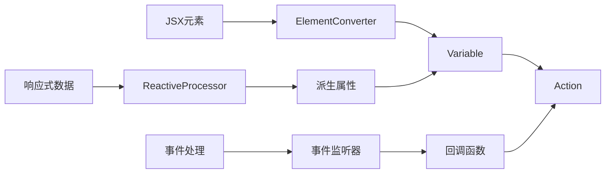
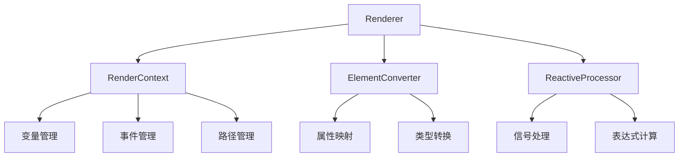
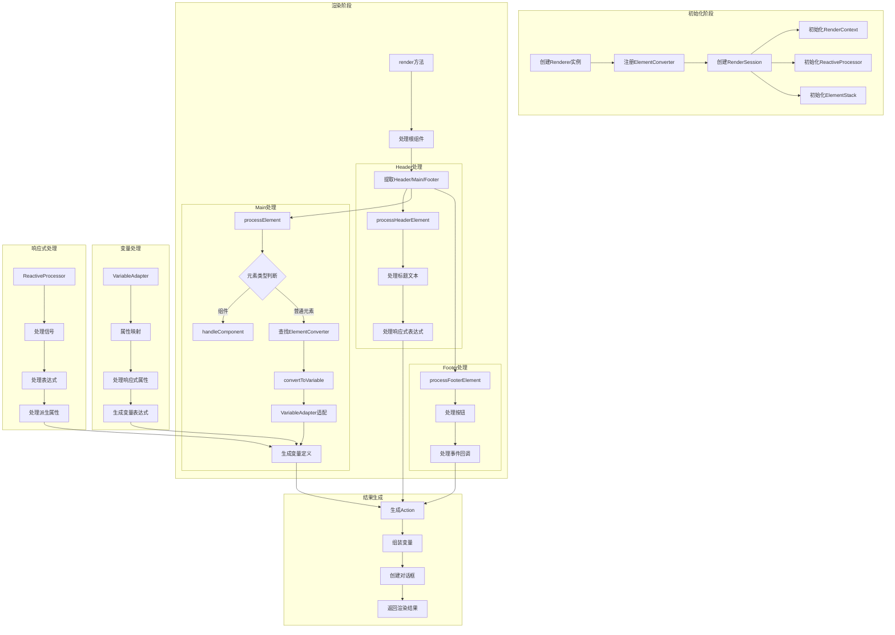

# Kodex
Kodex 是一个为自动精灵平台设计的声明式 UI 工具，其使用 JSX 结构描述自动精灵的 UI(设置变量动作)

# 预览

# TODO
- [x] 值更改事件 : onChange
- [x] 弹窗已创建Hook : dialogCreated
- [ ] select 元素更改默认选中 : 本身不提供,但可以通过更改 options 数组来实现
- [ ] 处理额外文本初次值为空字符串时后续更新无效的问题：即使没有使用Kodex也会这样，可能是自动精灵的机制或bug使然。可以通过显示一个1像素的图片来模拟空字符串

# NOTE
- 当 color 不是全格式时闪退
- 当 backgroundColor 为 null 时闪退
- 当 var name 不合法时闪退

# 架构

## 关键数据流

## 类关系

## 渲染流程

