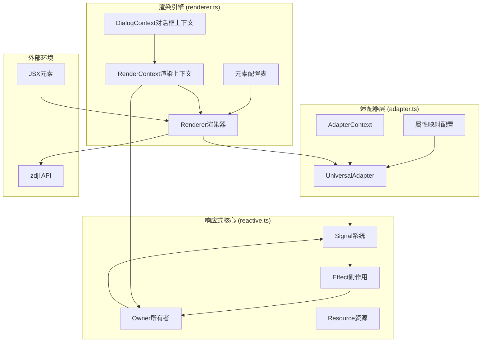

# 已知问题
> 目标环境的BUG，很难说服我自己为其打补丁
- [ ] select 元素更改默认选中: 按理来说可以通过修改 value 属性来实现，毕竟是从input派生的，但实际不起作用，即使没有使用 Kodex 也会这样，可能是目标环境的机制或 bug 使然。  
  替代方案：
  1. 更改 options 数组的元素顺序，将默认选中的元素放在最前面
- [ ] 额外文本初次值为空字符串时后续更新无效，即使没有使用 Kodex 也会这样，可能是目标环境的机制或 bug 使然。  
  替代方案：
  1. 使用一个1像素的图片来模拟空字符串
  2. 初始值设置为空格字符串

# 已知问题
- [ ] 声明周期函数理论上可以嵌套添加回调，但测试时发生无法执行的情况 - 修复优先级：低

# NOTE
- 当 color 不是全格式时闪退
- 当 backgroundColor 为 null 时闪退
- 当 var name 不合法时闪退  
- 当开启 memo(记住值) 时下次的默认值使用最后保存的值, 并且:
  - 无视本次设置的值: 上次的值比这次的值的优先级高, 这有点反直觉, 自动精灵特性, 并且我不知道怎么解决
  - 值更改事件无效: 符合预期, 符合人体工学, 毕竟默认值本来就没有上次值, 没有差异就不会触发事件

# 图表

## 核心架构图


## 渲染流程图
```mermaid
flowchart TD
    Start[开始渲染] --> ExtractRoot[提取根元素]
    ExtractRoot --> ProcessHeader[处理Header]
    ExtractRoot --> ProcessMain[处理Main]
    ExtractRoot --> ProcessFooter[处理Footer]
    
    ProcessMain --> CheckType{检查元素类型}
    CheckType -->|Component| HandleComponent[处理组件]
    CheckType -->|Native Element| ConvertElement[转换为变量]
    
    HandleComponent --> ExecuteComponent[执行组件函数]
    ExecuteComponent --> ProcessChildren[处理子元素]
    ProcessChildren --> CheckType
    
    ConvertElement --> GetConfig[获取元素配置]
    GetConfig --> CreateAdapter[创建适配器]
    CreateAdapter --> ApplyMapping[应用属性映射]
    ApplyMapping --> ProcessReactive[处理响应式属性]
    
    ProcessReactive --> GenerateVar[生成变量定义]
    GenerateVar --> RegisterSignal[注册信号]

    RegisterSignal --> hoistValue[提升值到专用作用域]
    
    ProcessHeader --> CreateAction[创建动作]
    ProcessFooter --> CreateAction
    GenerateVar --> CreateAction
    
    CreateAction --> CreateEventEmitter[创建事件发射器]
    CreateEventEmitter --> ReturnResult[创建渲染结果]
    
    ReturnResult --> End[暴露show、变量定义等接口]
  ```
